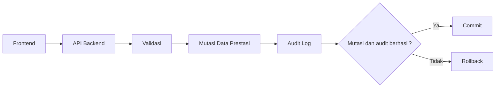

# Audit Trail Data Prestasi KONI Aceh

Status: desain siap diintegrasikan; backend belum tersedia di repository.

## 1. Latar belakang

Data rekapitulasi hasil lomba memengaruhi laporan prestasi KONI Aceh. Perubahan
seperti medali Perak menjadi Emas harus dapat ditelusuri kepada pelaku, waktu,
request, dan nilai sebelum/sesudah perubahan. Repository saat ini hanya berisi
dokumentasi security; tidak ada backend, migration framework, autentikasi,
modul prestasi, atau testing framework.

## 2. Tujuan audit trail

Audit trail bertujuan meningkatkan:

- integritas data dengan merekam snapshot perubahan;
- akuntabilitas actor yang melakukan mutasi;
- keterlacakan berdasarkan entitas, waktu, dan request;
- kemampuan investigasi menggunakan bukti aktivitas sistem;
- non-repudiation secara terbatas bila identitas actor dan kontrol akses dapat
  dipercaya.

Audit trail tidak otomatis menjadikan data sah secara hukum. Kebijakan
organisasi, kontrol identitas, retensi, chain of custody, serta mekanisme hukum
tambahan tetap diperlukan.

## 3. Ruang lingkup

Ruang lingkup saat ini adalah audit `CREATE`, `UPDATE`, `DELETE`, dan `ARCHIVE`
pada entitas prestasi, skema PostgreSQL, proteksi append-only, kontrak integrasi
dan API baca, redaction, threat model, contoh JSON, serta test plan.

Modul ini bukan aplikasi terpisah. Implementasi service, route, dan transaksi
nantinya ditempatkan pada backend yang sama dengan modul prestasi. Dokumen ini
tidak membuat asumsi tentang bahasa atau framework backend.

## 4. Istilah penting

| Istilah | Arti |
|---|---|
| Actor | Pengguna atau proses sistem yang memicu perubahan. |
| Entitas | Objek domain yang berubah, misalnya satu record `prestasi`. |
| Snapshot | Representasi object JSON dari row sebelum atau sesudah mutasi. |
| Append-only | Record dapat ditambah dan dibaca, tetapi tidak diubah/dihapus. |
| Request ID | UUID korelasi yang sama sepanjang satu request. |
| Redaction | Penggantian nilai sensitif dengan `[REDACTED]`. |

## 5. Alur



Frontend tidak menulis audit log secara langsung. Backend membentuk snapshot
dari row database dan menjalankan mutasi serta insert audit dalam satu transaksi.

## 6. Struktur tabel `audit_logs`

Definisi lengkap tersedia di [`sql/audit_logs.sql`](sql/audit_logs.sql).

| Kolom | Tipe | Fungsi |
|---|---|---|
| `id` | `BIGSERIAL` | Primary key audit. |
| `actor_id` | `BIGINT NULL` | ID pelaku tanpa FK sampai autentikasi tersedia. |
| `action` | `VARCHAR(16)` | Allow-list CREATE/UPDATE/DELETE/ARCHIVE. |
| `entity_type` | `VARCHAR(100)` | Tipe domain, misalnya `prestasi`. |
| `entity_id` | `BIGINT` | ID record domain. |
| `old_values` | `JSONB NULL` | Snapshot sebelum perubahan. |
| `new_values` | `JSONB NULL` | Snapshot sesudah perubahan. |
| `changed_fields` | `JSONB NULL` | Array nama field tingkat atas yang berubah. |
| `ip_address` | `INET NULL` | IP client berdasarkan trusted proxy. |
| `user_agent` | `TEXT NULL` | User-Agent yang dibatasi backend. |
| `request_id` | `UUID NULL` | ID korelasi request. |
| `created_at` | `TIMESTAMPTZ` | Waktu server database, default `NOW()`. |

Index disediakan untuk `(entity_type, entity_id)`, `actor_id`, `action`,
`created_at DESC`, dan `request_id` non-null. Constraint memastikan action valid,
entity type tidak kosong, snapshot berupa object, dan changed fields berupa array.

## 7. `old_values` dan `new_values`

Kedua kolom menyimpan object JSONB hasil database, bukan body request mentah:

- CREATE: `old_values = null`, `new_values = row hasil insert`;
- UPDATE: keduanya berisi snapshot sebelum dan sesudah;
- DELETE: `old_values = row sebelum delete`, `new_values = null`;
- ARCHIVE: keduanya berisi snapshot status sebelum dan sesudah archive.

Snapshot dari database penting agar default, cast, trigger bisnis, dan
normalisasi ikut terekam. Payload harus memuat data yang relevan saja dan telah
di-redact.

## 8. `changed_fields`

`changed_fields` adalah array JSON nama field tingkat atas yang nilainya berubah.
Untuk update medali saja, nilainya `["medali"]`. Perubahan anak di dalam
`metadata_dinamis` dicatat sebagai `["metadata_dinamis"]`; rincian nilai anak
tetap terlihat pada snapshot. Perbandingan dilakukan pada nilai ternormalisasi
dari database, bukan urutan key object JSON.

## 9. Mekanisme append-only

Fungsi `prevent_audit_log_mutation()` dan trigger database menolak `UPDATE`,
`DELETE`, dan `TRUNCATE` dengan pesan jelas dan SQLSTATE `42501`. `INSERT` dan
`SELECT` tetap diperbolehkan sesuai privilege role.

Di produksi, akun runtime aplikasi idealnya hanya memperoleh `INSERT`; role
pembaca berwenang memperoleh `SELECT`; aplikasi tidak memperoleh `UPDATE`,
`DELETE`, atau `TRUNCATE`. Nama role belum diketahui, sehingga SQL hanya
menyediakan contoh `GRANT`/`REVOKE` dalam komentar dan tidak membuat role.

Trigger tidak dapat melindungi dari superuser atau pemilik schema yang
menonaktifkannya. Pisahkan akun owner/migration dari runtime, audit aktivitas
administratif, dan pertimbangkan backup immutable atau sistem log eksternal.

## 10. Redaction data sensitif

Password, konfirmasi password, token, Authorization, cookie, session, API key,
secret, private key, serta isi PDF/file biner tidak boleh tersimpan dalam bentuk
asli. Nilainya diganti `"[REDACTED]"` secara rekursif pada object dan array
bertingkat. Request body/header mentah tidak boleh digunakan sebagai snapshot.

Aturan dan pseudocode lengkap tersedia di
[`audit-redaction-policy.md`](audit-redaction-policy.md). Contoh hasil tersedia
di [`examples/sensitive-data-redaction-audit.json`](examples/sensitive-data-redaction-audit.json).

## 11. Transaksi dan rollback

Mutasi prestasi dan insert audit wajib memakai transaksi serta koneksi database
yang sama:

1. Ambil row lama dengan lock bila perlu.
2. Validasi input.
3. Mutasi prestasi dan ambil row hasil.
4. Hitung field berubah dan sanitasi snapshot.
5. Insert audit log.
6. Commit hanya jika semua langkah berhasil.
7. Bila audit gagal, propagasikan error dan rollback seluruh mutasi.

Service audit tidak boleh membuka atau commit transaksi sendiri. Detail kontrak
terdapat pada
[`audit-integration-contract.md`](audit-integration-contract.md).

## 12. API read-only

API konseptual hanya menyediakan:

```http
GET /api/v1/audit-logs
GET /api/v1/audit-logs/{id}
```

Daftar mendukung pagination, filter entitas/actor/action/rentang tanggal, dan
urutan `created_at DESC, id DESC`. PUT, PATCH, dan DELETE audit log tidak boleh
tersedia. Akses GET wajib autentikasi dan otorisasi khusus setelah modul user dan
role tersedia. Lihat [`audit-api-contract.md`](audit-api-contract.md).

## 13. Contoh Perak menjadi Emas

```json
{
  "actor_id": 7,
  "action": "UPDATE",
  "entity_type": "prestasi",
  "entity_id": 15,
  "old_values": {
    "medali": "Perak"
  },
  "new_values": {
    "medali": "Emas"
  },
  "changed_fields": [
    "medali"
  ],
  "request_id": "85e509ab-564b-4518-9028-0f79450e465c"
}
```

Contoh lengkap: [`examples/prestasi-update-audit.json`](examples/prestasi-update-audit.json).

## 14. Ketergantungan terhadap backend

Mahasiswa Backend masih perlu menyediakan:

- migration native sesuai stack yang akhirnya dipilih;
- service `recordAuditLog` dan sanitizer rekursif;
- transaksi dan row locking untuk CRUD prestasi;
- middleware request UUID, IP trusted proxy, dan User-Agent;
- validasi batas ukuran snapshot dan panjang User-Agent;
- endpoint GET, query terparameterisasi, pagination, dan error response;
- integration/automated test pada PostgreSQL nyata.

## 15. Ketergantungan terhadap autentikasi

Model user/role belum tersedia. Karena itu `actor_id` belum memakai foreign key
dan API belum dapat diberi policy konkret. Setelah autentikasi tersedia:

- mutasi manusia harus memiliki actor terautentikasi;
- actor null hanya untuk proses sistem yang terdokumentasi;
- hak mutasi prestasi dan hak baca audit dipisahkan;
- role database runtime dan pembaca audit mengikuti least privilege;
- akses baca audit juga dicatat oleh sistem observability yang sesuai.

## 16. Batasan implementasi saat ini

- Belum ada backend, server, migration, autentikasi, modul prestasi, atau test
  runner.
- SQL merupakan referensi PostgreSQL, belum migration framework.
- Skrip manual tersedia tetapi belum dijalankan tanpa koneksi PostgreSQL.
- Tidak ada automated test atau endpoint yang diklaim sudah bekerja.
- Retensi, partitioning, backup, hash chaining/WORM, dan kebijakan delete versus
  archive belum diputuskan.
- Append-only menyediakan keterlacakan, bukan tamper-proof terhadap administrator
  database.

## 17. Tahap integrasi berikutnya

1. Tim backend menetapkan stack, migration tool, schema prestasi, dan transaksi.
2. Ubah SQL referensi menjadi migration tanpa menghilangkan tipe, constraint,
   index, komentar, atau trigger.
3. Implementasikan sanitizer dan service audit sesuai kontrak.
4. Integrasikan pada CREATE, UPDATE, DELETE, dan ARCHIVE prestasi.
5. Tambahkan autentikasi, role pembaca, middleware request context, dan API GET.
6. Jalankan [`sql/audit_logs_test.sql`](sql/audit_logs_test.sql) pada PostgreSQL.
7. Implementasikan test plan dan perbarui status hanya berdasarkan hasil aktual.
8. Tetapkan retensi, backup, monitoring, dan respons insiden bersama organisasi.
